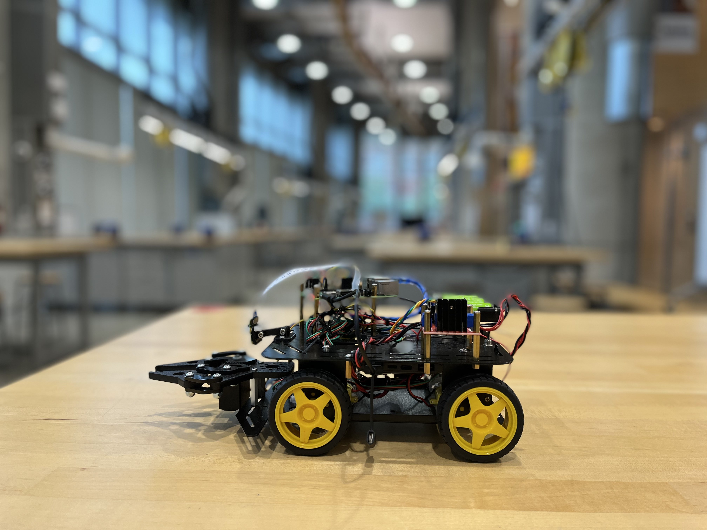
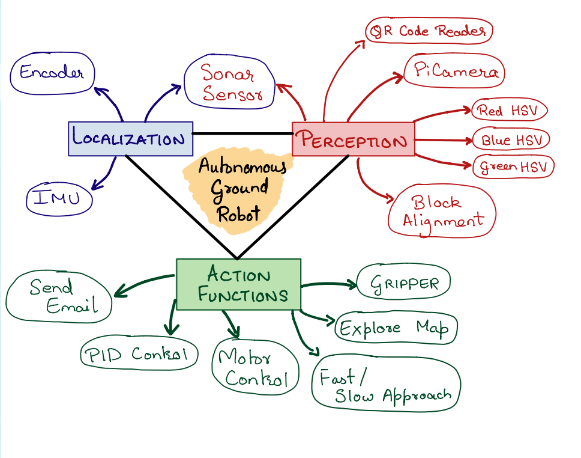
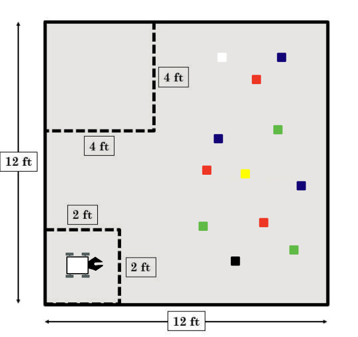
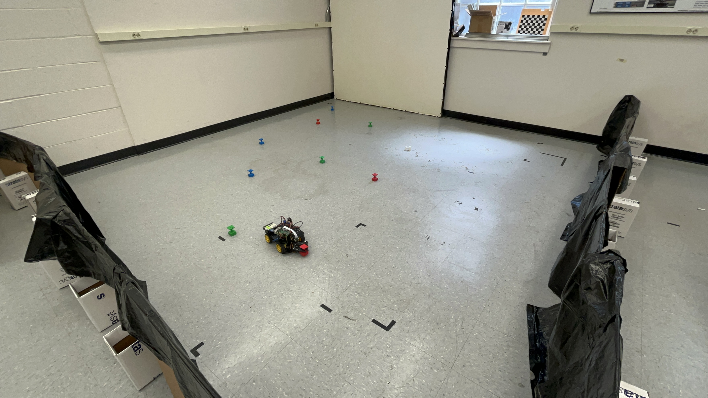
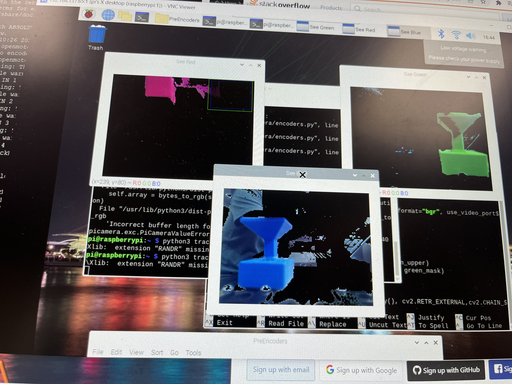
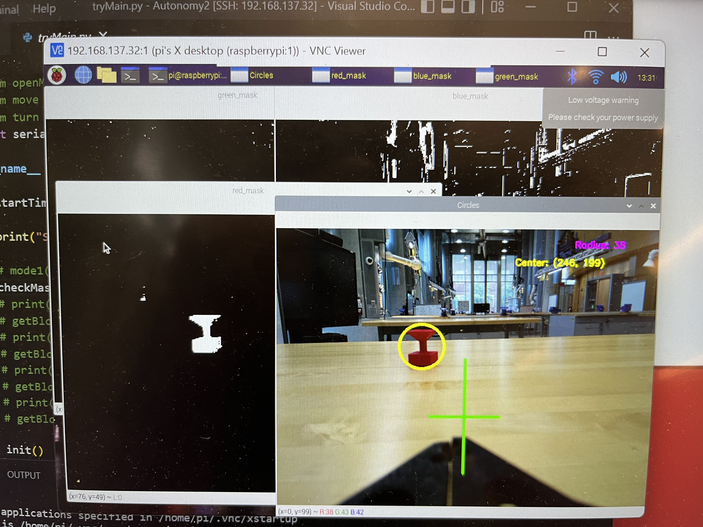

# ENPM809T - FinalChallenge

As part of the ENPM809T - Autonomous Robots course, I built a robot that can autonomously complete an object detection and object retrieval task. This repository contains the Program Files associated with this project. The robot is named Atlas.

A detailed overview of my semester-long journey can be found [here](https://www.youtube.com/watch?v=zvqpyTr6hrM), in my Project Video.

## Images

#### The Robot 

  
  

#### The Arena

  
  

#### Perception

  
  

## Support

For any questions, email me at jaisharm@umd.edu
